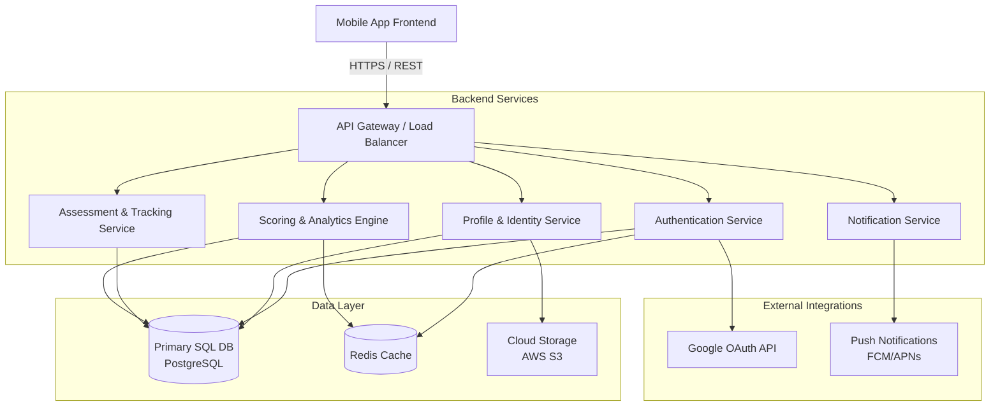
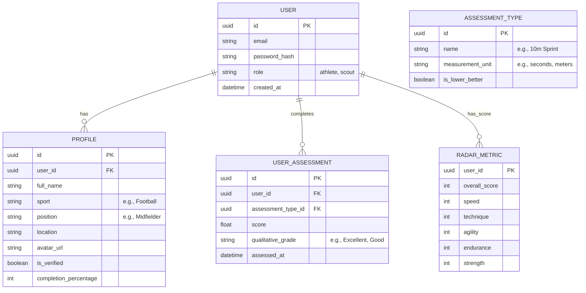

# SportTalent Backend Reference Architecture

Based on the provided frontend screens for the "SportTalent" mobile application, this document outlines the proposed backend architecture required to power its features.

## 1. High-Level System Architecture

The architecture follows a modular, service-oriented design. Clients communicate via an API Gateway, which routes requests to specialized backend services.

## 2. Core Backend Components

### A. Authentication Service
- **Responsibilities:** Handles traditional email/password login, Google OAuth integration, session management, and JWT token issuance.
- **Key Features:** Password hashing (bcrypt), token refresh rotation, and role-based access control (Athlete vs. Scout).

### B. Profile & Identity Service
- **Responsibilities:** Manages user onboarding, profile completion tracking (e.g., the "80% completed" bar), and basic user data.
- **Key Features:** Handles profile picture uploads to secure cloud storage (AWS S3) and manages verification status (the "Verified Athlete" badge).

### C. Assessment & Tracking Service
- **Responsibilities:** Stores and retrieves historical and recent assessments (e.g., 10m Sprint, Vertical Jump).
- **Key Features:** Time-series tracking of performance metrics, standardization of test formats, and localized timestamps.

### D. Scoring & Analytics Engine
- **Responsibilities:** Aggregates assessment data to calculate the user's "Overall Score" and individual radar chart metrics (Speed, Technique, Agility, Strength, Endurance).
- **Key Features:** Caches heavy calculations in Redis to ensure the Talent Card loads instantly.

### E. Notification Service
- **Responsibilities:** Powers the bell icon alerts and sends push notifications for new scout views, assessment reminders, or platform updates.

---

## 3. Recommended Technology Stack

* **API Gateway & Routing:** Nginx or AWS API Gateway
* **Backend Framework:** Node.js (Express/NestJS) or Python (FastAPI/Django)
* **Primary Database:** PostgreSQL (Relational structure is ideal for tracking users, structured assessments, and time-series scores)
* **Caching Layer:** Redis (For session state and caching complex radar chart calculations)
* **Storage:** AWS S3 (For user avatars and potential video proof of assessments)
* **Authentication:** JWT (JSON Web Tokens) with Google OAuth 2.0 SDK

---

## 4. Data Model (Relational Schema)

---

## 5. Core API Endpoints

To support the three screens provided, the backend will need to expose the following RESTful endpoints:

### Auth & Onboarding (Screen 1)
* `POST /api/v1/auth/login` - Authenticates via email/password.
* `POST /api/v1/auth/google` - Handles Google OAuth sign-in.
* `POST /api/v1/auth/forgot-password` - Triggers password reset flow.

### Dashboard (Screen 2)
* `GET /api/v1/users/me/profile` - Fetches greeting name, avatar, and profile completion %.
* `GET /api/v1/users/me/assessments?limit=3` - Fetches the "Recent Assessments" list (Test name, score, grade, and timestamp).

### Talent Card (Screen 3)
* `GET /api/v1/users/{id}/talent-card` - Returns the aggregated data for the Talent Card:
  * Bio (sport, position, location, verification status).
  * Overall score.
  * Radar chart axis scores (Speed, Technique, Agility, Strength, Endurance).
