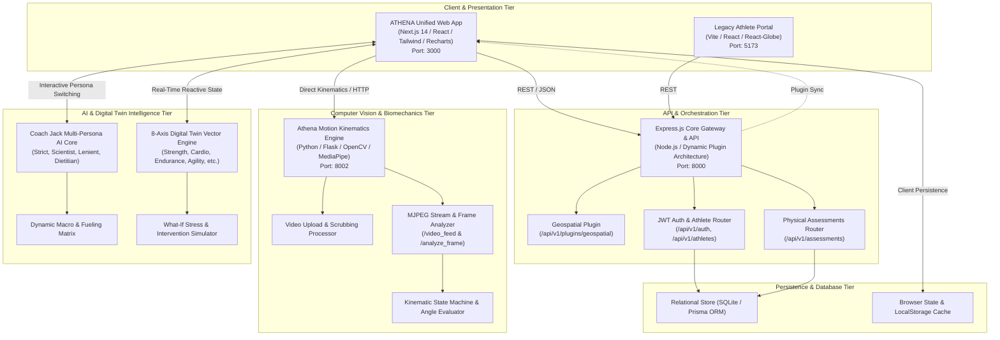
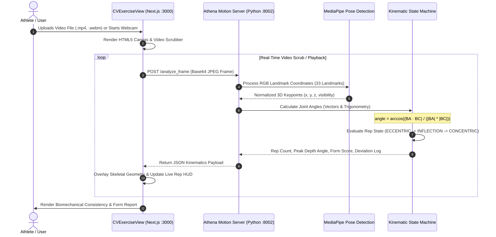
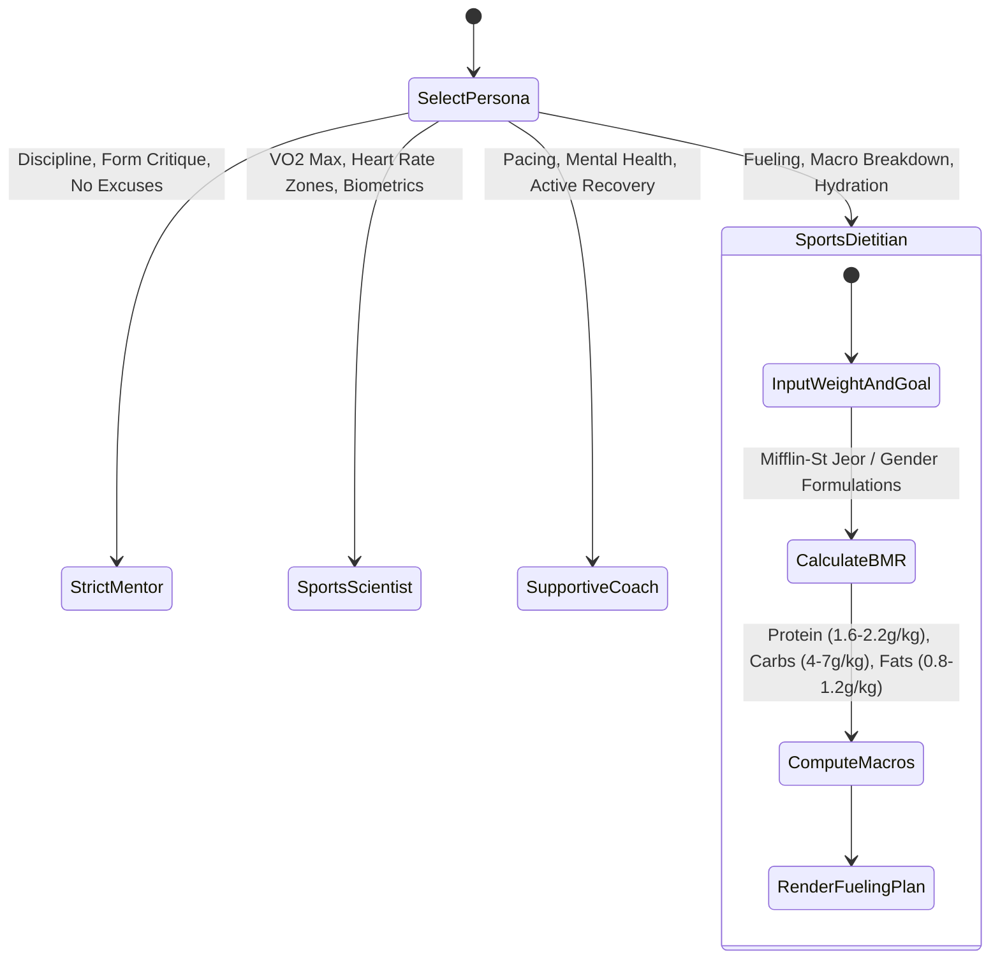
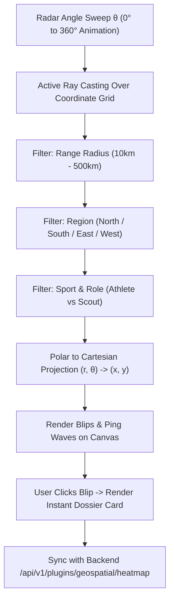
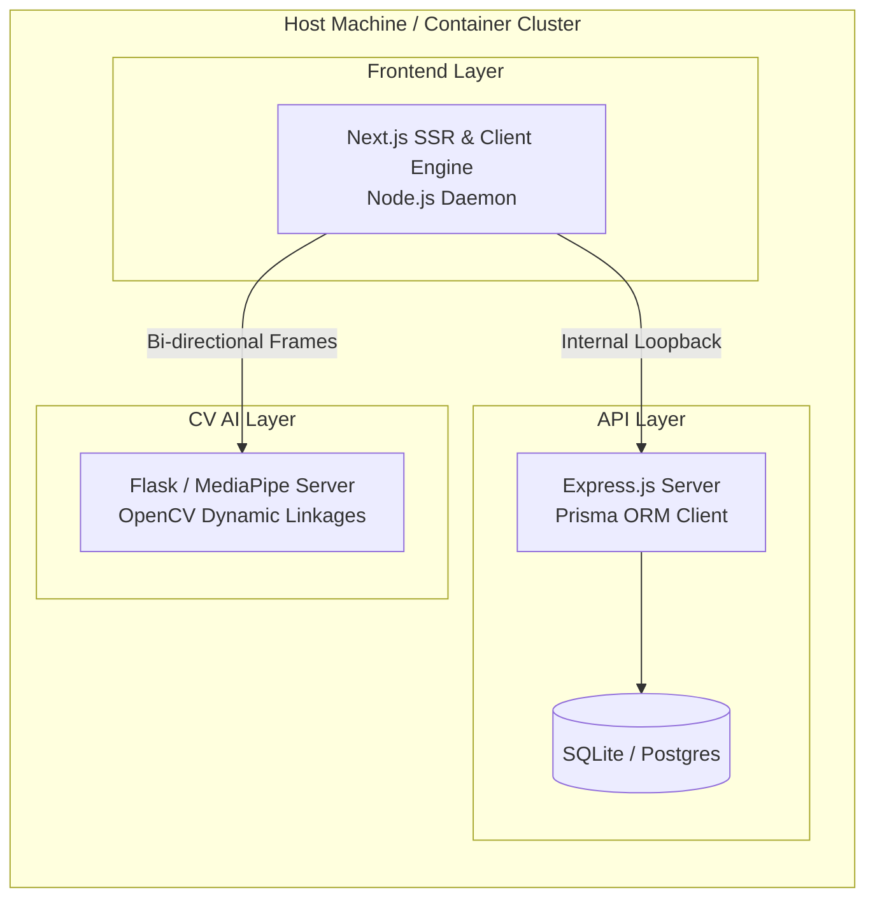

# ATHENA & Sport Talent: Full-Proof System Architecture

## 1. Executive Architecture Overview

The **ATHENA & Sport Talent Platform** is a distributed, multi-tier sports science and athletic intelligence ecosystem. It unifies high-performance athletic telemetry, computer vision biomechanics, mathematical digital twinning, and geospatial talent discovery into a reactive, microservice-powered architecture.

---

## 2. Multi-Tier Microservice Topology

The platform operates across four primary operational ports, ensuring fault tolerance, independent scaling, and zero single points of failure:

| Service Layer | Port | Technology | Primary Functionality |
| :--- | :--- | :--- | :--- |
| **Next.js Unified Web App** | `3000` | Next.js 14, React 18, TypeScript, TailwindCSS, Recharts, Lucide | Core athlete dashboard, Digital Twin, Coach Jack interface, Geospatial 360° Radar, and Video Kinematics portal. |
| **Express.js Backend API** | `8000` | Node.js, Express, Helmet, Morgan, Prisma, SQLite | Secure JWT authentication, athlete profiles, physical assessment history, and dynamic modular plugin routes. |
| **Athena Motion CV Service** | `8002` | Python 3.10+, Flask, OpenCV (`cv2`), MediaPipe Pose (33 keypoints) | Live webcam streaming, local video frame extraction, joint angle trigonometry, and rep count validation. |
| **Vite Athlete Client** | `5173` | React, Vite, Three.js, React-Globe | Legacy 3D globe visualization and cross-platform athlete onboarding. |

---

## 3. Subsystem Architecture & Data Flow

### 3.1. Computer Vision & Athena Motion Kinematics (Port 8002)

#### Technical Formulation:
1. **Pose Landmark Extraction**: MediaPipe Pose extracts 33 3D body landmarks. For squat and pushup evaluations, the platform isolates:
   - Hip ($L_{23}$ / $L_{24}$), Knee ($L_{25}$ / $L_{26}$), Ankle ($L_{27}$ / $L_{28}$)
   - Shoulder ($L_{11}$ / $L_{12}$), Elbow ($L_{13}$ / $L_{14}$), Wrist ($L_{15}$ / $L_{16}$)
2. **Angle Calculation**:
   $$\theta = \arccos\left(\frac{\vec{u} \cdot \vec{v}}{\|\vec{u}\| \|\vec{v}\|}\right) \times \frac{180}{\pi}$$
   Where $\vec{u} = A - B$ and $\vec{v} = C - B$ represent the limb vectors around joint $B$.
3. **Rep State Machine**:
   - `START` $\rightarrow$ Neutral extension ($\theta > 160^\circ$).
   - `INFLECTION` $\rightarrow$ Joint flexion reaches full contraction depth ($\theta < 90^\circ$ for squats).
   - `COMPLETED` $\rightarrow$ Joint returns to extension; rep count incremented, rep duration and peak depth saved.

---

### 3.2. Dynamic Digital Twin & Fitness Engine Sync

```mermaid
flowchart LR
    subgraph Inputs ["Physical Assessment Inputs"]
        P1["Pushups (Max Reps)"]
        P2["Squats (Max Reps)"]
        P3["Plank Hold (Sec)"]
        P4["Situps (Max Reps)"]
        P5["2.4km Pace (min/km)"]
        P6["Sit-and-Reach (cm)"]
        P7["Single-Leg Stance (sec)"]
    end

    subgraph Calculation ["Real-Time Dynamic Normalization"]
        MATH["Mathematical Vector Normalizer<br/>Weighted Baselines & Curve Clamping"]
    end

    subgraph Twin_Vector ["8-Axis Dimensional Twin State"]
        V_STR["Strength (0-100)"]
        V_END["Endurance (0-100)"]
        V_CAR["Cardio (0-100)"]
        V_MOB["Mobility (0-100)"]
        V_FLX["Flexibility (0-100)"]
        V_BAL["Balance (0-100)"]
        V_AGI["Agility (0-100)"]
        V_CON["Consistency (0-100)"]
    end

    subgraph Views ["Synchronized Real-Time Views"]
        RADAR["Recharts 8-Axis Radar Chart<br/>(DigitalTwinView.tsx)"]
        DASH["Main Dashboard Readiness<br/>(DashboardView.tsx)"]
        SIM["What-If Intervention Engine<br/>(SimulatorView.tsx)"]
    end

    Inputs --> MATH
    MATH --> Twin_Vector
    Twin_Vector --> RADAR
    Twin_Vector --> DASH
    Twin_Vector --> SIM
```

- When the athlete adjusts physical sliders in `FitnessEngineView.tsx`:
  - $S_{\text{strength}} = \text{clamp}\left(\frac{\text{Pushups}}{50} \times 50 + \frac{\text{Squats}}{60} \times 50, 20, 100\right)$
  - $S_{\text{cardio}} = \text{clamp}\left(100 - (\text{Pace} - 3.5) \times 12, 30, 100\right)$
  - $S_{\text{mobility}} = \text{clamp}\left(50 + \frac{\text{Reach}}{35} \times 50, 30, 100\right)$
- Clicking **"Sync & Recalibrate My Twin"** triggers top-level state propagation in `page.tsx`, reshaping all Recharts visualizations and longitudinal curves without page reload.

---

### 3.3. Coach Jack Multi-Attitude AI & Nutrition Engine

Coach Jack contains 4 deterministic prompt persona drivers and an embedded sports dietitian calculation suite:

---

### 3.4. Interactive 360° Geospatial Talent Radar

The Geospatial Radar simulates military-grade active sonar sweeps for national sports talent discovery:

---

## 4. Security, Authentication & Session Architecture

- **Token Handling**: Standard RFC 7519 JSON Web Tokens (JWT) signed using HMAC-SHA256.
- **Client Storage**: Tokens and verification states are cached in `localStorage` under keys `athena_token`, `athena_user`, and `athena_profile_completion`.
- **Route Protection**: Next.js App Router client components evaluate session presence. Unauthenticated requests redirect immediately to `/login`.
- **Dynamic Profile Completeness Verification**:
  $$\text{Completeness} = \left(\frac{\sum_{i=1}^N \mathbb{I}(\text{field}_i \text{ is valid})}{N}\right) \times 100\%$$
  Fields evaluated: Full Name, Gender, Date of Birth, Height, Weight, Primary Sport, Experience Level, Geographic Location, and Target Goal.

---

## 5. Dynamic Backend Plugin System (Port 8000)

The Node.js Express server implements an automated plugin discovery engine:
1. On boot, `backend/server.js` scans the `backend/plugins/` directory.
2. For every subdirectory containing an `index.js`, the server requires the module.
3. If valid `baseRoute` and `router` exports exist, Express mounts the sub-application dynamically.
4. This decouples specialized features (such as `geospatial` heatmap intelligence) from core authentication, enabling zero-downtime additions and zero git merge conflicts.

---

## 6. High Availability & Deployment Topology

This ensures complete decoupling: if the computer vision process requires heavy GPU/CPU cycles for high-frame-rate video analysis, the primary web application and authentication servers remain fully responsive.
